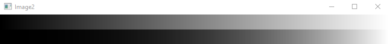
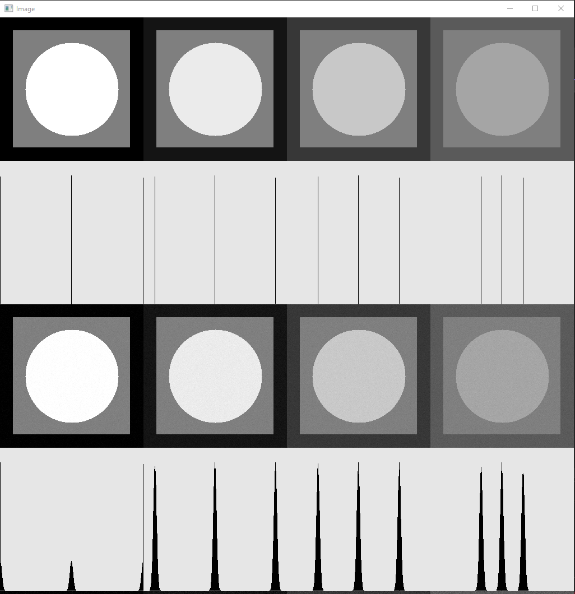
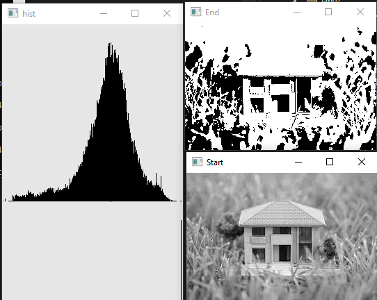
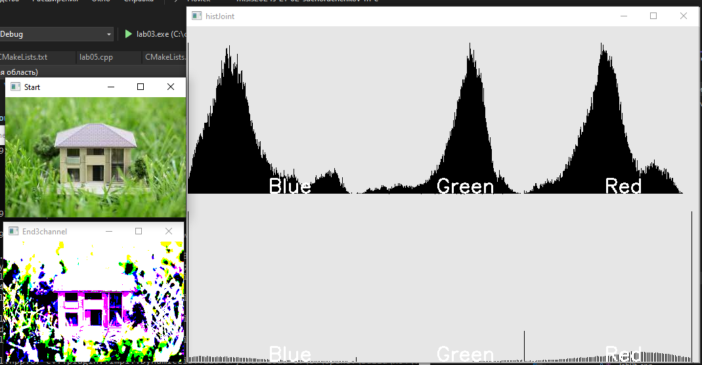
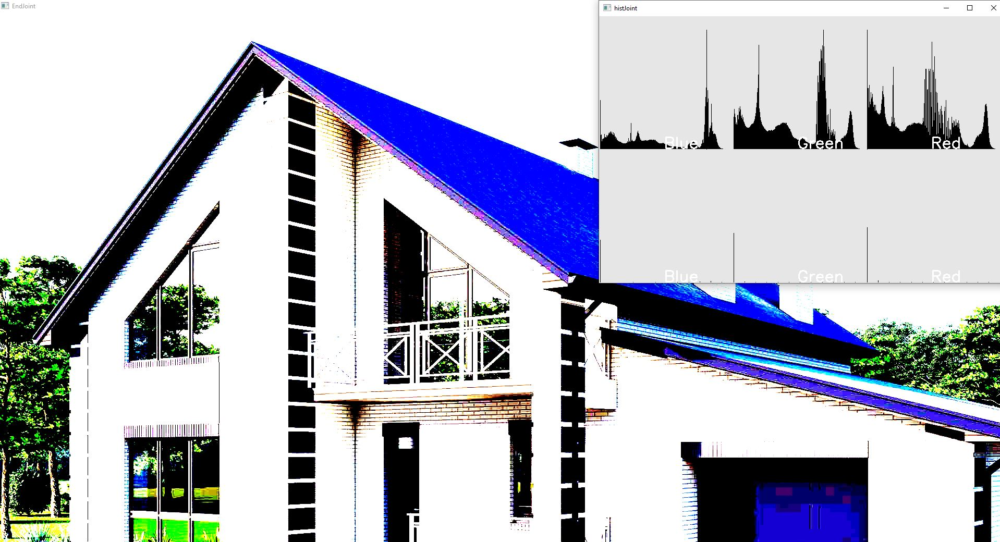
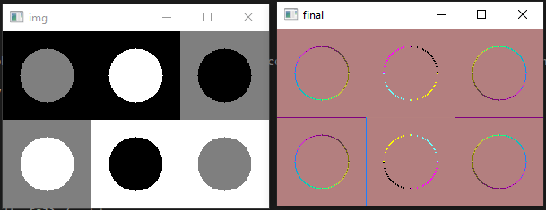
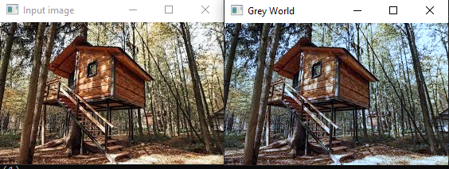

# Отчет по 1 ЛР

Цель:

Достижение навыков работы с изображениями, в том числе их создание и обработка, с применением основных функций библиотеки OpenCV.

Ход выполнения:

В рамках первой лабораторной работы было разработано консольное приложение, предназначенное для создания одноканального изображения с градиентной и гамма-скорректированной заливкой. Гамма-коррекция реализована в виде соответствующей функции.

Основные моменты программы:

1. Функция `gammaCorrection` принимает изображение в формате OpenCV Mat и коэффициент гамма, используемый для коррекции яркости изображения. 
   - Для каждого значения интенсивности пикселя от 0 до 255 вычисляется новое значение с учетом гамма-коррекции.
   - Затем с помощью функции `cv::LUT` применяется Look-Up Table (LUT) к изображению для применения гамма-коррекции.

2. В функции `main`:
   - Программа принимает параметры из командной строки для настройки размеров изображения, высоты и ширины полос, значения гамма и имени файла для сохранения результата.
   - Создается изображение с черно-белыми полосами по всему спектру яркости (от черного до белого).
   - Выбирается область интереса (ROI) изображения для применения гамма-коррекции.
   - Применяется функция `gammaCorrection` к выбранной области с указанным значением гамма.
   - Если не указано имя файла для сохранения, результат отображается в окне с помощью `cv::imshow`.
   - Если указано имя файла для сохранения, результат сохраняется в указанном файле.

Программа демонстрирует применение гамма-коррекции к определенной области изображения с заданными параметрами.

Результат:

# Отчет по 2 ЛР

Цель:

Научиться создавать и анализировать гистограммы яркости изображений с различными значениями среднеквадратичного отклонения шума.

Ход работы:

В рамках второй лабораторной работы были реализованы необходимые функции для генерации изображений с четырьмя уровнями яркости, построения гистограмм яркости на квадратном растре и добавления аддитивного нормального несмещенного шума.

Основные моменты программы:

1. Функция `generateTestImage` создает тестовое изображение с заданными уровнями интенсивности для трех областей: прямоугольной, круговой и центральной.
   - Изображение создается размером 256x256 пикселей с начальным заполнением нулями.
   - Затем на изображении рисуются прямоугольные, круговые и центральные области с заданными уровнями интенсивности.
   - Функция возвращает созданное изображение.

2. Функция `drawHistogram` создает гистограмму изображения.
   - Используя функцию `cv::calcHist`, вычисляется гистограмма интенсивности пикселей на изображении.
   - Гистограмма нормализуется и отображается в виде графика на фоне.

3. Функция `addNoise` добавляет шум к изображению.
   - Для каждого пикселя изображения генерируется случайное значение с помощью метода Box-Muller для получения нормально распределенного шума.
   - Заданное стандартное отклонение шума учитывается при добавлении шума к пикселям изображения.

4. В функции `main`:
   - Задаются параметры для интенсивности и уровня шума.
   - Создается базовое изображение размером 256x256 пикселей, в котором будут размещены тестовые изображения, гистограммы и изображения с добавленным шумом.
   - Для каждого набора параметров интенсивности и уровня шума:
     - Создается тестовое изображение с заданными уровнями интенсивности.
     - Рисуется гистограмма для тестового изображения.
     - Создается изображение с добавленным шумом.
     - Рисуется гистограмма для изображения с шумом.
     - Все изображения размещаются вертикально в базовом изображении.
   - Итоговое изображение отображается с помощью `cv::imshow`.

Программа создает и отображает серию тестовых изображений с гистограммами и добавленным шумом для различных уровней интенсивности и шума.

Результат:

# Отчет по 3 ЛР

Цель:

Научиться созданию и примененнию функций автоконтрастирования черно-белых и цветных изображений по квантилям.

Ход работы:

В рамках второй лабораторной работы были реализовано консольное приложение с функциями для автоконтрастирования черно-белых и цветных изображений по квантилям.

Основные моменты программы:

1. Функция `drawHistogram` создает гистограмму для одноканального изображения.
   - Вычисляется гистограмма интенсивности пикселей.
   - Гистограмма нормализуется и отображается на фоне изображения.

2. Функция `drawHistogram3Channels` создает гистограммы для трех каналов цветного изображения.
   - Каждый канал изображения разделяется.
   - Для каждого канала вычисляется и отображается гистограмма.

3. Функция `quanteles` вычисляет квантили для заданного процента черного и белого уровней.
   - Вычисляется квантиль для черного и белого уровней интенсивности на основе заданного процента.

4. Функции `autoContrastOneChannel`, `autoContrastChannelWise` и `autoContrastJoint` применяют автоконтраст к изображению.
   - Автоконтраст применяется к одному каналу, к нескольким каналам и ко всем каналам одновременно соответственно.
   - Для каждого канала вычисляются черные и белые пороги на основе заданных квантилей.
   - Создается Look-Up Table (LUT) для применения автоконтраста.
   - Каналы изображения преобразуются с использованием LUT для автоконтраста.

5. В функции `main`:
   - Если изображение цветное, применяется автоконтраст к каждому каналу и ко всем каналам одновременно, отображаются результаты и гистограммы.
   
Программа позволяет применять автоконтраст к изображениям, как одноканальным, так и цветным, и отображать результаты автоконтраста, а также гистограммы до и после преобразования.

Результат:

Автоконтрастирование изображений:

Черно-белое при q0 = 0.3 и q1 = 0.7:

Цветное при при q0 = 0.4 и q1 = 0.6:

Автоконтрастирование цветного изображения совместное:

При при q0 = 0.3 и q1 = 0.7:

# Отчет по 4 ЛР

# Методы детекции окружностей

В лабораторной работы реализованы:
1. Метод детекции с помощью анализа компоненты связности (предобработка - бинаризция).
2. Блоб детекция. Реализованы два фильтра - LoG и DoG

## Описание логики методов детекции

1. **Метод локальной бинаризации и связанных компонент**:
   - Предварительно бинаризуется изображение с использованием алгоритмов локальной бинаризации.
   - С помощью функции `cv::connectedComponentsWithStats` находятся все связанные компоненты, их центры и площади.
   - Производится фильтрация шума - удаляются области со слишком маленькой площадью.

2. **Метод пирамиды масштабов и LoG/DoG фильтрации**:
   - Строится пирамида масштабов изображения.
   - Для каждого уровня пирамиды и для каждого значения сигмы в заданном диапазоне применяется фильтр LoG (Лапласиан Гауссиана) или DoG (Разность Гауссианов).
   - С помощью эрозии находятся точки с минимальным откликом фильтра.
   - Для всех найденных точек и соответствующих им радиусов определяются пересечения, сохраняются только значения с минимальным откликом (центры и радиусы).

## Результаты

### Пример применения LoG фильтра

### Пример применения DoG фильтра

### Пример примения эрозия для нахождения центров

### Пример бинаризации Ниблека

# Отчет по 5 ЛР

Цель:

Автоконтрастирование по квантилям черного и белого одноканального изображения.

Ход работы:

Код принимает на вход размер изображений и радиус кругов, затем генерирует тестовое изображение с кругами различной интенсивности.

Затем в функции main задаются ядро фильтра (kernel) и транспонированное ядро (kernelTran). Используя функцию cv::filter2D, изображение фильтруется с помощью этих ядер. После фильтрации для каждого пикселя вычисляется новое значение интенсивности на основе предыдущего значения с использованием линейной функции c(x) = 127.5 + 0.2 * c_prev(x). Это позволяет нормализовать диапазон интенсивности пикселей от [-255, 255] до [0, 255], учитывая возможные отрицательные значения после фильтрации. Этот процесс повторяется как для kernel, так и для kernelTran.

Далее на основе двух полученных изображений вычисляется третье изображение по формуле sqrt(x1x1 + x2x2), где x1 и x2 - значения интенсивности соответствующих пикселей из двух изображений.

Наконец, три изображения объединяются в одно трехканальное изображение, где каждый канал соответствует результатам фильтрации и вычисления производной изображений.

Таким образом, данный код выполняет операции фильтрации изображений, нормализации интенсивности, вычисления производных и объединения результатов в трехканальное изображение для дальнейшего анализа и визуализации.

Основные моменты программы:

1. Функция `testImage` создает изображение с различными кругами разного цвета на фоне. Функция принимает ширину и высоту изображения, а также радиус кругов.
2. В функции `main`:
   - Создается изображение с помощью функции `testImage` с заданными параметрами.
   - Отображается начальное изображение.
   - Создается ядро для фильтрации (пример - дискретная аппроксимация производной).
   - Применяется фильтрация изображения с помощью функции `cv::filter2D`.
   - Результат фильтрации преобразуется в отображаемый формат (CV_8UC1) с помощью цикла для корректного отображения.
   - Второе ядро создается для фильтрации транспонированным образом.
   - Фильтрация второго ядра и преобразование результата аналогично первому ядру.
   - Вычисляется производная по двум направлениям и результат сохраняется в отдельное изображение.
   - Создается трехканальное изображение, объединяющее результаты фильтрации в разные каналы.
   - Отображаются промежуточные и конечное результаты фильтрации.

Результат:

# Отчет по 9 ЛР

Цель:
Выполнить цветокоррекцию изображения.

Функция `greyWorldCorrection` принимает на вход изображение в формате OpenCV Mat и выполняет следующие действия:
1. Разделяет изображение на отдельные каналы цвета.
2. Вычисляет среднее значение яркости пикселей для всего изображения.
3. Вычисляет среднее значение яркости для каждого канала цвета.
4. Вычисляет коэффициенты масштабирования для каждого канала таким образом, чтобы среднее значение яркости всех каналов было равно среднему значению яркости пикселей на всем изображении.
5. Умножает значения пикселей каждого канала на соответствующий коэффициент масштабирования.
6. Объединяет каналы обратно в изображение.

Результат:

1. **Mean Absolute Error (MAE)**: 
   - Значение: 16.3808
   - Описание: Среднее абсолютное отклонение между исходным и исправленным изображениями. Это средняя величина разницы между соответствующими пикселями двух изображений. Более низкое значение MAE означает, что исправленное изображение ближе к исходному.

2. **Peak Signal-to-Noise Ratio (PSNR)**:
   - Значение: 26.3392 dB
   - Описание: Пиковое отношение сигнал-шум. Это метрика, которая показывает соотношение между максимально возможным сигналом и уровнем шума. Более высокое значение PSNR означает лучшее качество изображения. Значение 26.3392 dB является относительно низким, что указывает на наличие заметных различий между исходным и исправленным изображениями.

3. **Structural Similarity Index (SSIM)**:
   - Значение: 1
   - Описание: Структурное сходство. Это метрика, которая оценивает сходство структурных характеристик между исходным и исправленным изображениями. Значение 1 означает полное сходство, то есть исправленное изображение полностью идентично исходному.

Эти метрики показывают, что исправленное изображение довольно близко к исходному, но все же есть заметные различия. Высокое значение SSIM (1) указывает на то, что структурные характеристики изображений практически идентичны, но более высокие значения MAE и относительно низкий PSNR свидетельствуют о наличии различий в цветопередаче и контрасте.
