# misis2024s-21-02-suchoruchenkov-m-e

# Отчет по 1 ЛР

### Цель

Достижение навыков работы с изображениями, в том числе их создание и обработка, с применением основных функций библиотеки OpenCV.

### Ход работы

В рамках первой лабораторной работы было разработано консольное приложение, предназначенное для создания одноканального изображения с градиентной и гамма-скорректированной заливкой. Гамма-коррекция реализована в виде соответствующей функции.

Программа демонстрирует применение гамма-коррекции к определенной области изображения с заданными параметрами.

### Вывод

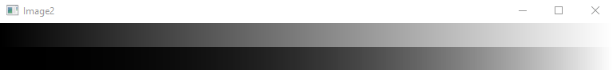

# Отчет по 2 ЛР

### Цель

Научиться создавать и анализировать гистограммы яркости изображений с различными значениями среднеквадратичного отклонения шума.

### Ход работы

В рамках второй лабораторной работы были реализованы необходимые функции для генерации изображений с четырьмя уровнями яркости, построения гистограмм яркости на квадратном растре и добавления аддитивного нормального несмещенного шума.

Программа создает и отображает серию тестовых изображений с гистограммами и добавленным шумом для различных уровней интенсивности и шума.

### Вывод

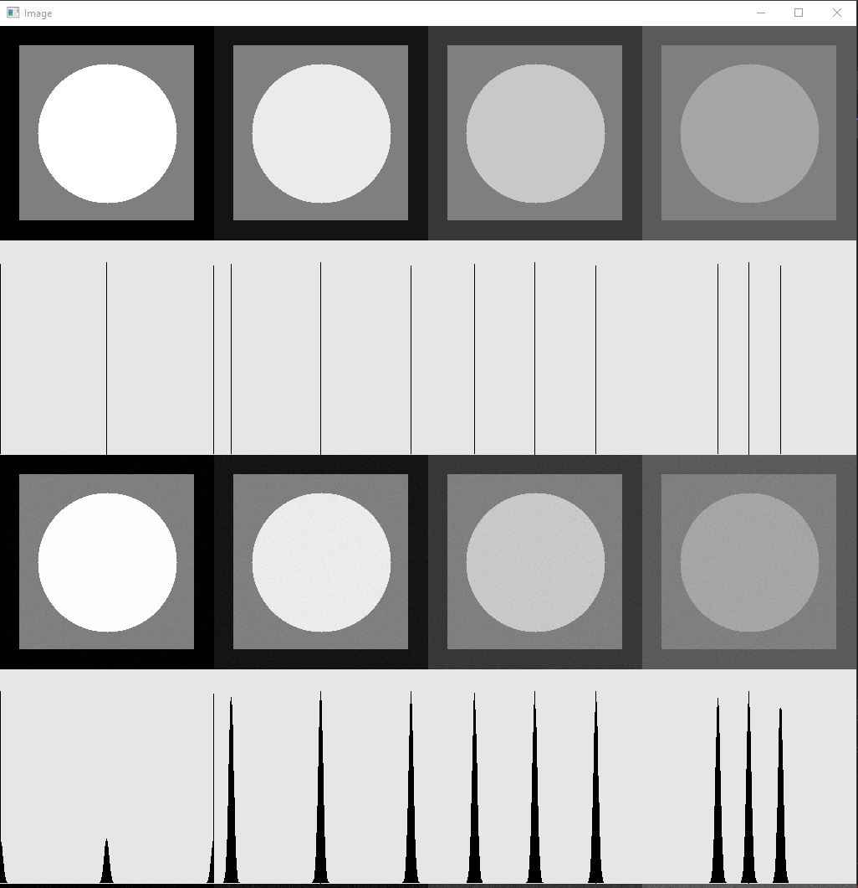

# Отчет по 3 ЛР

### Цель

Научиться созданию и примененнию функций автоконтрастирования черно-белых и цветных изображений по квантилям.

### Ход работы

В рамках второй лабораторной работы были реализовано консольное приложение с функциями для автоконтрастирования черно-белых и цветных изображений по квантилям.
   
Программа позволяет применять автоконтраст к изображениям, как одноканальным, так и цветным, и отображать результаты автоконтраста, а также гистограммы до и после преобразования.

### Вывод

Автоконтрастирование изображений:

Черно-белое при q0 = 0.3 и q1 = 0.7:

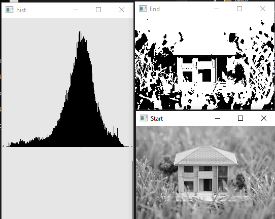

Цветное при при q0 = 0.4 и q1 = 0.6:

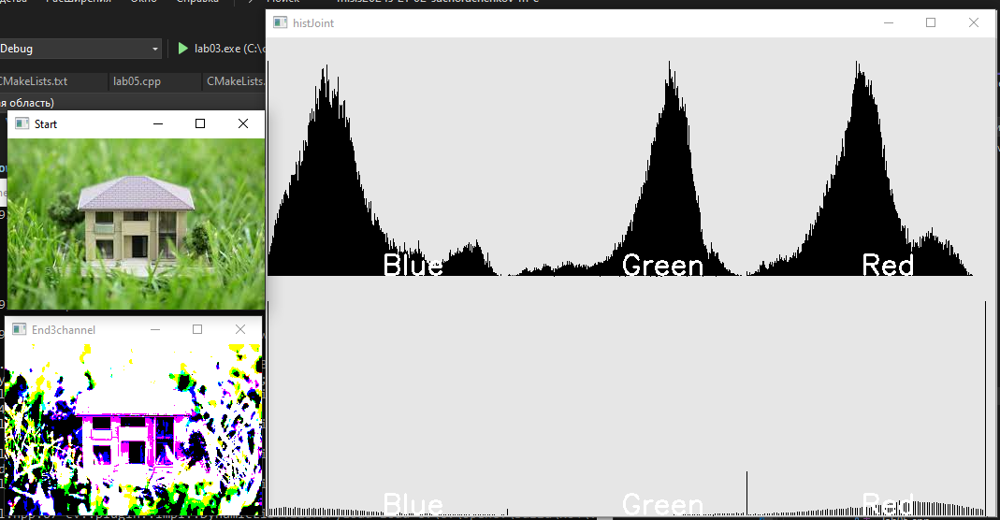

Автоконтрастирование цветного изображения совместное:

При при q0 = 0.3 и q1 = 0.7:

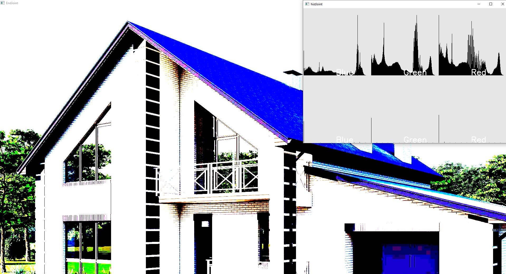

# Отчет по 4 ЛР

### Цель

Изучить и реализовать различные методы бинаризации изображений. Рассмотреть возможные варианты создания GUI для измененния параметров бинаризации, а также реализовать функционал для детектирования объектов изображения с возможностью оценки качества детектирования.

### Теория

### Метод Бернсена для бинаризации изображений

**Описание**: Метод Бернсена — это адаптивный алгоритм бинаризации, который использует локальные характеристики контраста для преобразования серых изображений в бинарные.

**Основные шаги**:

1. **Локальные минимумы и максимумы**:
   - Для каждого пикселя вычисляются минимальное и максимальное значения яркости в окне радиуса \(r\) вокруг него.

2. **Вычисление контраста**:
   - Контраст определяется как \(C = I_{max} - I_{min}\).

3. **Установка порога**:
   - Если \(C > C_{min}\):
     - Порог \(T\) устанавливается как \((I_{min} + I_{max}) / 2\).
   - В противном случае порог может быть фиксированным.

4. **Бинаризация**:
   - Пиксель становится белым (\(255\)), если его значение больше порога \(T\), и черным (\(0\)) в противном случае.

**Преимущества**:
- Адаптивность к локальным условиям освещения.
- Гибкость в настройке параметров.

**Недостатки**:
- Чувствительность к шуму.
- Зависимость от правильного выбора параметров.

**Применение**: Идеален для изображений с переменным освещением, используется в OpenCV для улучшения качества бинаризации.

### Метод Ниблака для бинаризации изображений

**Описание**: Метод Ниблака — это адаптивный алгоритм бинаризации, который использует локальное среднее и стандартное отклонение для определения порога бинаризации в каждом пикселе.

**Основные шаги**:

1. **Определение локального окна**:
   - Для каждого пикселя вычисляется среднее значение (\(m\)) и стандартное отклонение (\(std\)) яркости в окне радиуса \(r\).

2. **Установка порога**:
   - Порог \(T\) для бинаризации вычисляется как:
     \[
     T(x, y) = m + k \cdot std + d
     \]
   - Здесь \(k\) — коэффициент, который регулирует влияние стандартного отклонения, а \(d\) — смещение.

3. **Бинаризация**:
   - Пиксель становится белым (\(255\)), если его значение больше порога \(T\), и черным (\(0\)) в противном случае.

**Параметры**:
- **\(r\)**: радиус окна для вычисления локальных статистик.
- **\(k\)**: коэффициент, который определяет, насколько стандартное отклонение влияет на порог.
- **\(d\)**: смещение, добавляемое к порогу.

**Преимущества**:
- Адаптивность к локальным условиям освещения и контрасту.
- Хорошо работает на изображениях с неоднородным освещением.

**Недостатки**:
- Чувствительность к шуму, особенно в областях с низким контрастом.
- Зависимость от выбора параметров \(k\) и \(d\) для достижения оптимального результата.

**Применение**: Широко используется в задачах обработки изображений для выделения объектов на фоне с переменным освещением, например, в медицинской визуализации и анализе изображений.

### Основные понятия для оценки детекции объектов

1. **Истинные положительные (TP)**:
   - Количество правильно обнаруженных объектов. Это случаи, когда детектор правильно идентифицировал объект, который действительно присутствует в изображении.

2. **Ложные положительные (FP)**:
   - Количество объектов, которые были ошибочно обнаружены детектором. Это случаи, когда детектор идентифицировал объект, но на самом деле его не было.

3. **Ложные отрицательные (FN)**:
   - Количество объектов, которые не были обнаружены детектором, хотя они действительно присутствовали в изображении. Это случаи, когда детектор пропустил существующий объект.

### Критерий IoU (Intersection over Union)

- **IoU** — это метрика, используемая для оценки качества детекции. Она вычисляется как отношение площади пересечения предсказанного bounding box (рамки) и истинного bounding box к площади их объединения:
  
  \[
  \text{IoU} = \frac{\text{Area of Overlap}}{\text{Area of Union}}
  \]

### Ход работы

В ходе выполнения лабораторной работы была написана программа, которая генерирует тестовое изображение с заданными параметрами и реализует несколько вариантов бинаризации. Также был предусмотрен режим визуальной настройки параметров бинаризации через GUI, реализован функционал для детектирования объектов на изображении и для оценки качества работы алгоритмов.

1. Изображение с параметрами генерации countCircles=10, minRadius=5, maxRadius=15, minContrast=50, maxContrast=255, blur=4, noise=4:

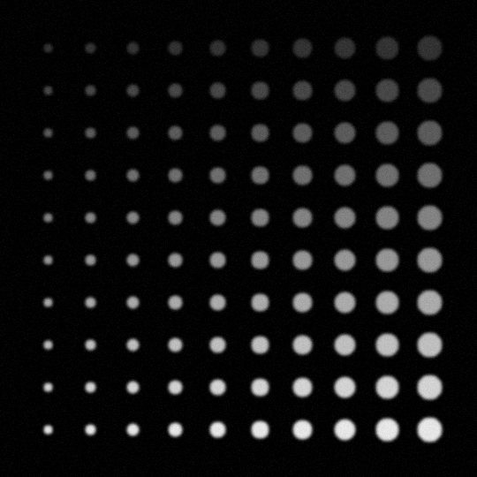

Пример работы GUI:

Бинаризация исходного изображения методом Бернсена:

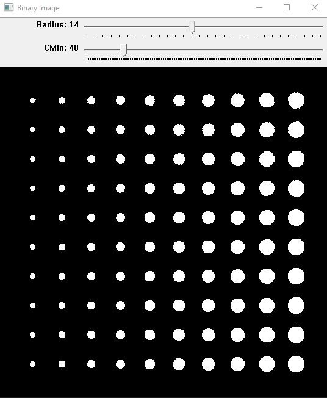

Детектирование при параметрах radius = 14, CMin = 40:

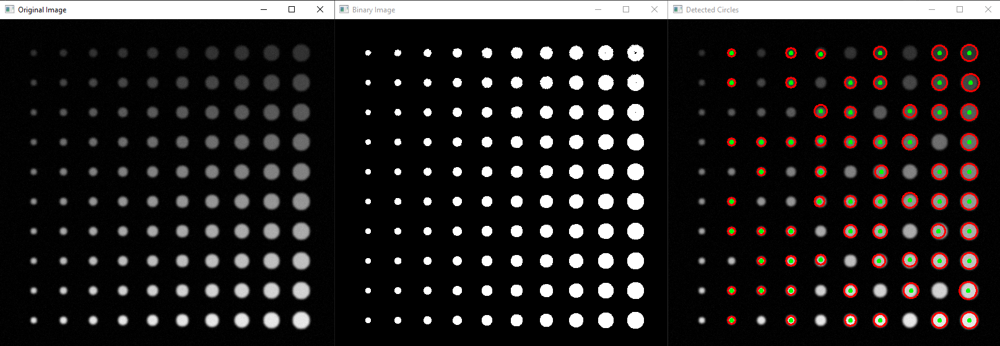

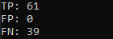

Пример работы GUI:

Бинаризация исходного изображения методом Ниблека:

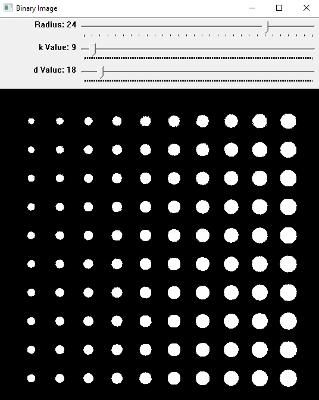

Детектирование при параметрах Radius = 24, k Value = 9, d Value = 18:

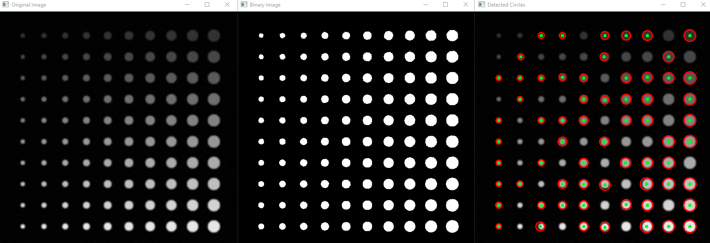

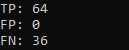

2. Изображение с параметрами генерации countCircles=5, minRadius=5, maxRadius=15, minContrast=25, maxContrast=200, blur=3, noise=5:

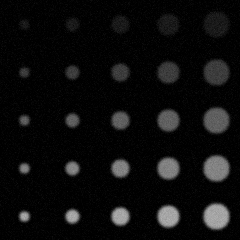

Детектирование при параметрах radius = 14, CMin = 40, бинаризация Бернсена:

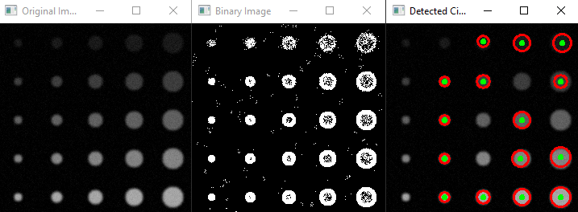

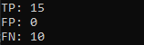

Детектирование при параметрах Radius = 8, k Value = 9, d Value = 7, бинаризация Ниблека:

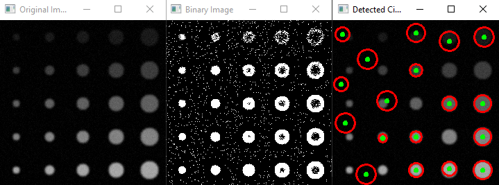

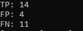

3. Изображение с параметрами генерации countCircles=7, minRadius=5, maxRadius=20, minContrast=40, maxContrast=180, blur=3, noise=7:

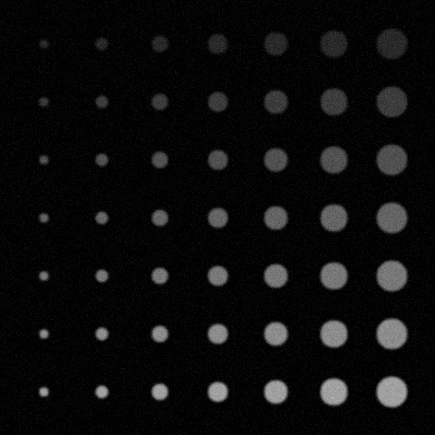

Детектирование при параметрах radius = 10, CMin = 30, бинаризация Бернсена:

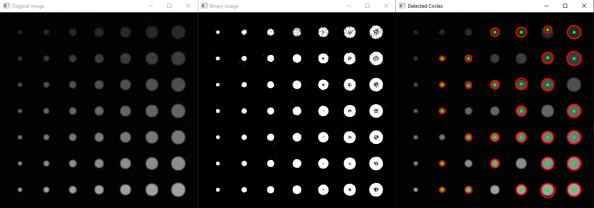

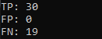

Детектирование при параметрах Radius = 20, k Value = 9, d Value = 23, бинаризация Ниблека:

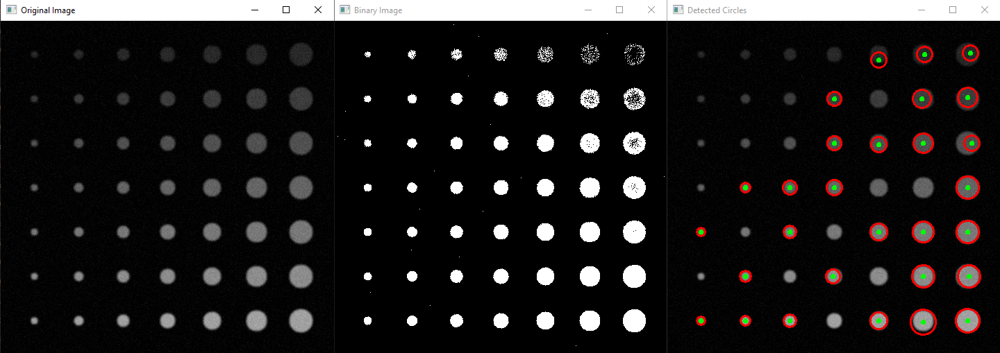

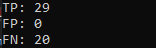

### Вывод

Как можем заметить, объекты детектируются лучше, при бинаризации методом Ниблека.

# Отчет по 5 ЛР

Цель:

Автоконтрастирование по квантилям черного и белого одноканального изображения.

## Ход работы

В ходе выполнения лабораторной работы была разработана программа, которая генерирует тестовое изображение с кругами, применяет фильтрацию и визуализирует результаты.

### Генерация тестового изображения

Программа создает тестовое изображение размером 297x297 пикселей, состоящее из нескольких кругов различного цвета и радиуса. Круги располагаются в разных частях изображения, что позволяет создать разнообразные визуальные элементы для дальнейшей обработки.

После генерации тестового изображения программа применяет два различных фильтра:

1. **Первый фильтр** использует ядро, которое выделяет разницу между соседними пикселями. Это позволяет выявить границы объектов на изображении.

2. **Второй фильтр** основан на транспонированном ядре, что также помогает в выделении границ, но изменяет акценты в результатах фильтрации.

Результаты фильтрации отображаются в отдельных окнах, предоставляя возможность визуально оценить, как каждый фильтр влияет на исходное изображение.

Для объединения результатов фильтрации по двум направлениям программа вычисляет корень суммы квадратов значений, полученных из двух фильтров. Это позволяет создать комбинированное изображение, которое более полно отражает границы объектов.

### Создание цветного изображения

После обработки результаты фильтрации объединяются в трехканальное цветное изображение. Каждый канал соответствует результатам фильтрации по двум направлениям и их производной. Это дает возможность визуально оценить различные аспекты обработки и выделить детали, которые могут быть неочевидны в черно-белом изображении.

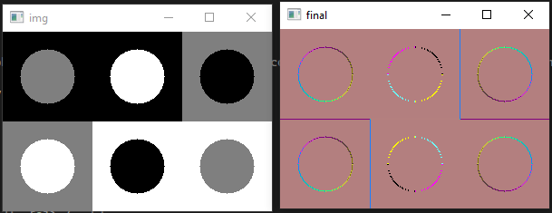

### Вывод

В ходе работы над лабораторной работой было продемонстрировано, что использование метода автоконтрастирования по квантилям черного и белого значительно улучшает качество изображений с низким контрастом. Программа наглядно показала, как применение различных фильтров и их комбинация позволяют адаптивно подстраивать яркость изображения, что делает его более информативным и визуально привлекательным. Результаты визуализации подтвердили, что автоконтрастирование является полезным инструментом в обработке изображений, позволяющим повысить их качество и удобство восприятия.

# Отчет по 6 ЛР

### Цель

Изучить и реализовать методы детектирования объектов на изображениях с использованием преобразования Хафа. Рассмотреть возможность оценки качества детектирования с помощью анализа FROC (Free-Response Operating Characteristic) и визуализировать результаты работы алгоритмов.

### Теория

### Метод детектирования объектов с использованием преобразования Хафа

**Что это такое**: Метод преобразования Хафа — это способ нахождения фигур, таких как линии и круги, на изображениях.

**Как работает**:
1. **Голосование**: Каждый пиксель (например, пиксель края объекта) "голосует" за параметры формы (например, где находится центр круга и какой у него радиус).
2. **Параметрическое пространство**: Все голоса собираются в специальное пространство, где каждая ось соответствует разным параметрам (например, координаты центра круга и его радиус).
3. **Находим фигуры**: Параметры, которые получили больше всего голосов, считаются найденными фигурами.

**Почему это полезно**:
- Хорошо работает даже при наличии шума.
- Помогает находить определенные формы на изображении.

**Где применяется**: Используется для распознавания кругов, линий и других фигур в задачах обработки изображений и компьютерного зрения.

### Ход работы

В ходе выполнения лабораторной работы была разработана программа, которая генерирует тестовое изображение с заданными параметрами и реализует функционал для детектирования кругов на изображениях. Программа также включает методы бинаризации изображений, такие как метод Ниблака, и предоставляет возможность визуальной настройки параметров через GUI.

Тестовое изображение с параметрами генерации  количество кругов=10, минимальный радиус=5, максимальный радиус=15, минимальный контраст=50, максимальный контраст=255, уровень размытия=4:

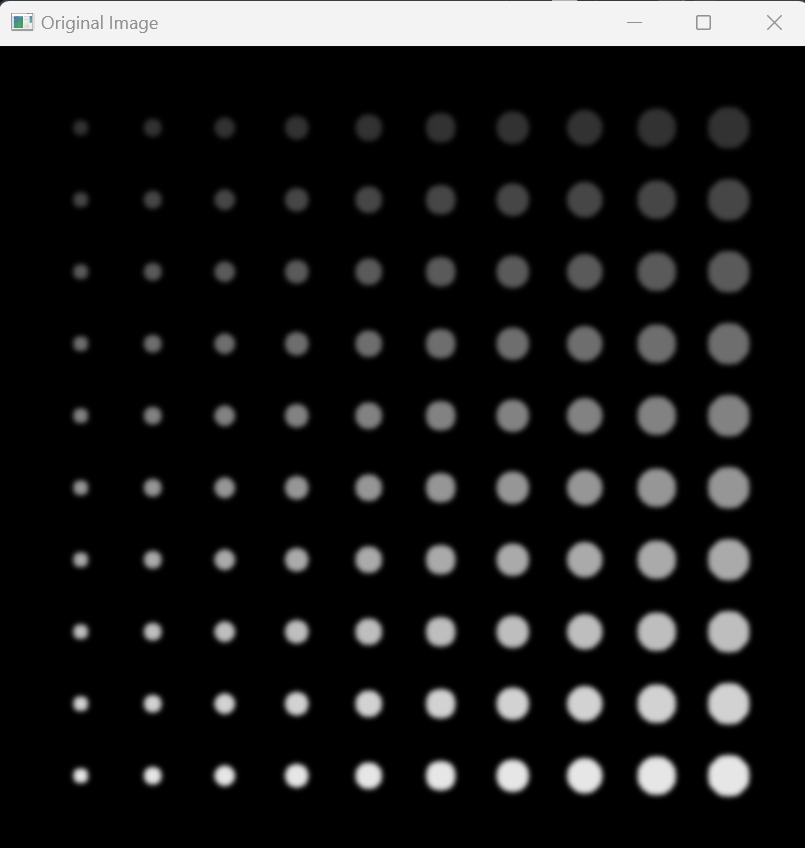

#### Бинаризация исходного изображения методом Ниблака

Бинаризация изображения методом Ниблака позволяет выделить объекты на изображении с использованием локальных значений яркости:

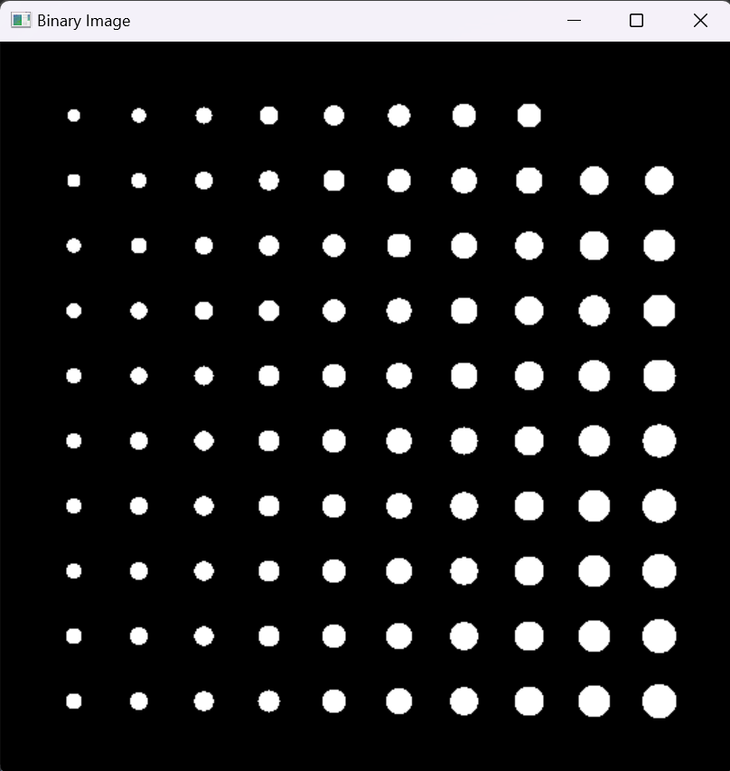

#### Детектирование кругов

Детектирование кругов было выполнено с использованием метода преобразования Хафа. Ниже представлены результаты детектирования при параметрах: `Radius = 24`, `k Value = 9`, `d Value = 18`:

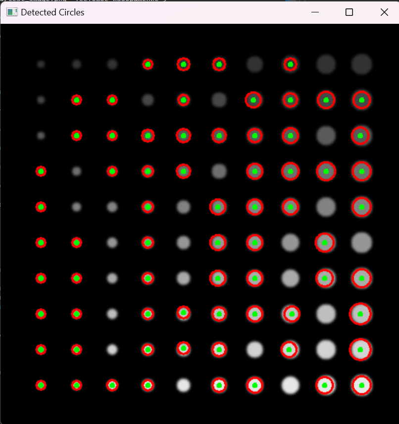

#### Оценка качества детектирования

Для оценки качества детектирования были собраны данные о количестве истинно положительных (TP), ложноположительных (FP) и ложноотрицательных (FN) ответов. Результаты FROC-анализа для различных порогов IoU (Intersection over Union):

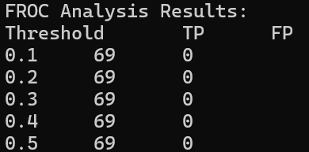

### Вывод

В ходе работы над лабораторной работой было продемонстрировано, что использование метода Ниблака для бинаризации изображений позволяет более эффективно детектировать объекты по сравнению с другими методами. Результаты анализа FROC показали, что количество истинно положительных ответов увеличивается при повышении порога IoU, что подтверждает эффективность предложенного алгоритма детектирования.

# Отчет по 7 ЛР

### Цель

Изучить и реализовать метод сегментации изображений. Рассмотреть возможные варианты оценки качества сегментации с использованием эталонной разметки и реализовать функционал для этого.

### Теория

### Edge-Based сегментация объектов изображения

**Описание**: Edge-Based сегментация — это метод обработки изображений, который фокусируется на выявлении границ (или краев) объектов на изображении. Этот подход основан на использовании изменений яркости в изображении, что позволяет выделить контуры объектов.

**Как работает**:
1. **Выделение границ**: Используется фильтр Кэнни, который определяет границы, основываясь на градиенте изображения. Границы представляют собой участки с резкими изменениями яркости.
2. **Поиск контуров**: После выделения границ применяются алгоритмы для поиска контуров, которые представляют собой замкнутые линии, описывающие объекты на изображении.

Edge-Based сегментация объектов изображения позволяет эффективно выделять объекты на основе их границ, а использование метрик, таких как IoU, Precision, Recall и F1 Score, помогает количественно оценить качество сегментации и эффективность алгоритмов обработки изображений.

### Метрики для оценки качества сегментации

### 1. **Intersection over Union (IoU)**:
   - **Что это**: IoU — это метрика, которая измеряет, насколько хорошо предсказанная область (например, обнаруженный объект) совпадает с истинной областью (ground truth). Это важный показатель в задачах сегментации и детекции объектов.
   - **Зачем используется**: IoU помогает оценить, насколько точно модель определяет объекты на изображении по сравнению с реальными объектами, что критично для оценки качества работы алгоритмов компьютерного зрения.

### 2. **Precision (Точность)**:
   - **Что это**: Precision показывает, насколько правильно модель идентифицирует объекты. Это доля правильно предсказанных объектов (истинно положительных) среди всех объектов, которые модель предсказала как положительные.
   - **Зачем используется**: Precision дает понимание о том, насколько точны предсказания модели. Высокая точность означает, что большинство предсказанных объектов действительно являются объектами, которые мы ищем.

### 3. **Recall (Полнота)**:
   - **Что это**: Recall измеряет, насколько хорошо модель находит все истинные объекты. Это доля правильно предсказанных объектов среди всех объектов, которые действительно существуют в данных.
   - **Зачем используется**: Recall позволяет оценить, насколько хорошо модель захватывает все объекты в изображении. Высокая полнота означает, что модель успешно находит большинство истинных объектов, даже если это приводит к увеличению ложных срабатываний.

### 4. **F1 Score (F1-мера)**:
   - **Что это**: F1 Score — это метрика, которая объединяет точность и полноту в одно число. Она помогает оценить баланс между ними, особенно когда важно учитывать как ложные положительные, так и ложные отрицательные предсказания.
   - **Зачем используется**: F1 Score полезен, когда необходимо найти баланс между точностью и полнотой, особенно в ситуациях, когда важно не только точно идентифицировать объекты, но и не пропускать их.

### Ход работы

В ходе лабораторной работы была написана программа, которая генерирует тестовое изображение из json с заданными параметрами и производит Edge-Based сегментацию объектов изображения с последующей оценкой метрик. 

Edge-Based сегментация - этот метод основывается на том, что границы объектов в изображениях обычно соответствуют резким изменениям интенсивности, цвета или текстуры.

### Вывод

Тестовые изображения с различными параметрами генерации:

1. size - 200x200, background color = 100, blur = 2.0, noise = 3.0:

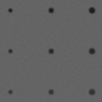

2. size - 375x375, background color = 85, blur = 2.0, noise = 3.0:

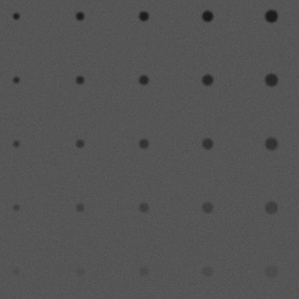

3. size - 475x475, background color = 65, blur = 2.0, noise = 5.0:

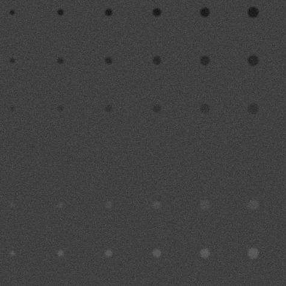

4. size - 525x525, background color = 200, blur = 4.0, noise = 5.0:

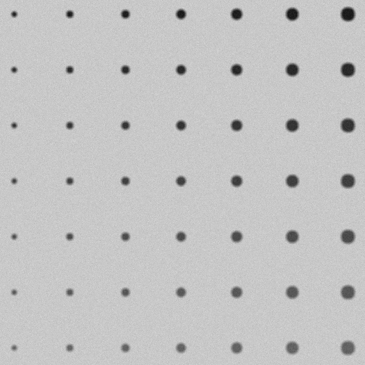

5. size - 525x525, background color = 25, blur = 4.0, noise = 5.0:

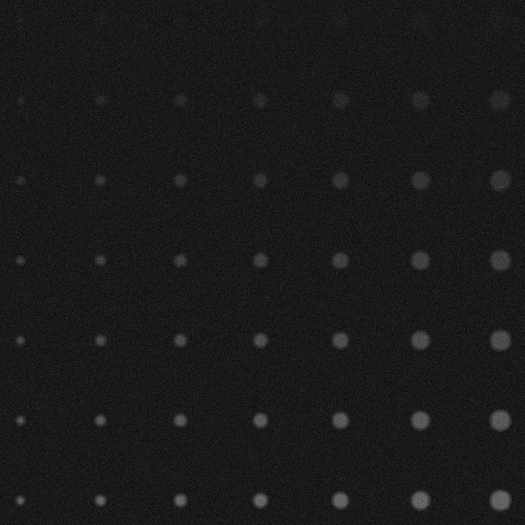

Соответствующие результаты сегментации:

1.
 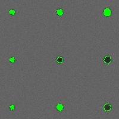

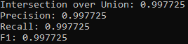

2.
 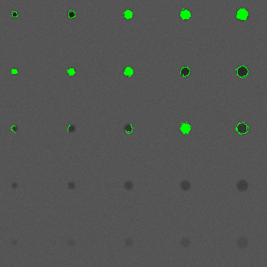

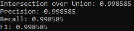

3.
 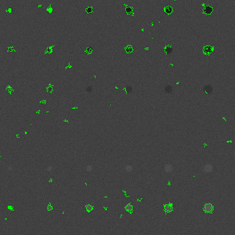

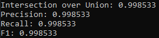

4.
 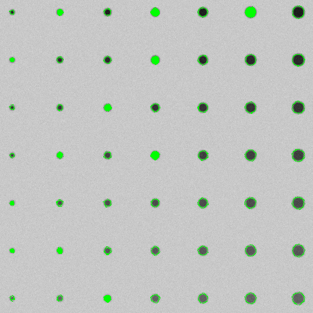

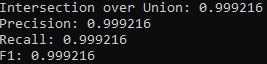

5.
 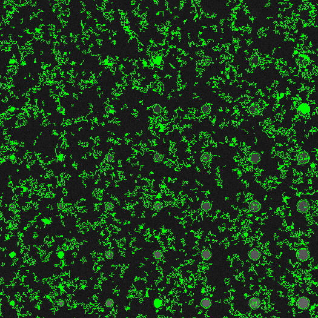

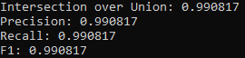

# Отчет по 8 ЛР

### Цель

Изучить плотность цветового распределения и визуализировать это в linRGB.

### Теория

### linRGB

**linRGB** (линейное RGB) — это цветовое пространство, в котором цвета представлены в линейной форме, без гамма-коррекции. Это позволяет более точно моделировать физические свойства света и улучшает точность вычислений в графике и обработке изображений.

### Плотность цветового распределения

**Плотность цветового распределения** — это мера, показывающая, как часто встречаются различные цвета в изображении. Она отображает количество пикселей определенного цвета и помогает визуализировать, какие цвета преобладают в изображении, что полезно для анализа цветовой информации и коррекции цвета.

### Ход работы

В ходе лабораторной работы было создано консольное приложение для визуализации плотности распределения цветов в пространстве linRGB.

Приложение работает с цветовым кубом RGB, в котором через точку (0.5, 0.5, 0.5) проходит плоскость, перпендикулярная вектору (1, 1, 1). Каждое цветовое значение проецируется на эту плоскость из точки (0, 0, 0).

Эта проекция позволяет анализировать распределение цветов, выявляя, как различные цвета соотносятся друг с другом, и создает 2D-изображение плотности, на котором отображается количество пикселей для каждого цвета. Визуализация плотности цветового распределения полезна для анализа цветовых оттенков и может быть использована для улучшения цветокоррекции в изображениях. Использование линейного RGB обеспечивает точность и корректность визуализации, что является важным для дальнейшего анализа цветовых характеристик изображения.

Исходные изображения:

1.
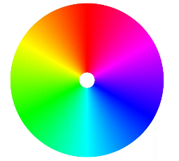

2.
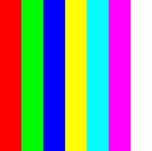

### Вывод

Результат:

1.
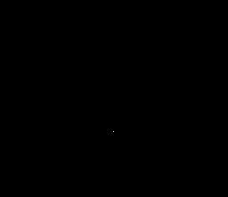

2.
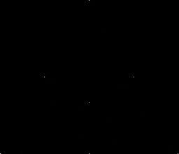

# Отчет по 9 ЛР

### Цель

Целью лабораторной работы является изучение метода цветокоррекции по методу **Grey World** и оценка качества полученного изображения. Метод Grey World предполагает, что средний цвет сцены близок к серому, и корректирует цвета в изображении для достижения этого баланса.

### Ход работы

Изучили и реализовали метод Gray World который вычисляет среднее значение цветовых каналов (RGB) изображения и корректирует каждый канал так, чтобы достичь серого баланса.

### Вывод

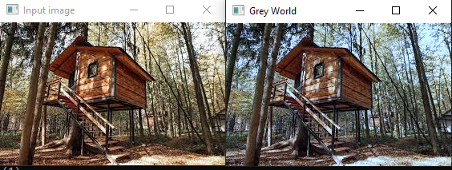

1. **Mean Absolute Error (MAE)**: 
   - Значение: 16.3808
   - Описание: Среднее абсолютное отклонение между исходным и исправленным изображениями. Это средняя величина разницы между соответствующими пикселями двух изображений. Более низкое значение MAE означает, что исправленное изображение ближе к исходному.

2. **Peak Signal-to-Noise Ratio (PSNR)**:
   - Значение: 26.3392 dB
   - Описание: Пиковое отношение сигнал-шум. Это метрика, которая показывает соотношение между максимально возможным сигналом и уровнем шума. Более высокое значение PSNR означает лучшее качество изображения. Значение 26.3392 dB является относительно низким, что указывает на наличие заметных различий между исходным и исправленным изображениями.

3. **Structural Similarity Index (SSIM)**:
   - Значение: 1
   - Описание: Структурное сходство. Это метрика, которая оценивает сходство структурных характеристик между исходным и исправленным изображениями. Значение 1 означает полное сходство, то есть исправленное изображение полностью идентично исходному.

Эти метрики показывают, что исправленное изображение довольно близко к исходному, но все же есть заметные различия. Высокое значение SSIM (1) указывает на то, что структурные характеристики изображений практически идентичны, но более высокие значения MAE и относительно низкий PSNR свидетельствуют о наличии различий в цветопередаче и контрасте.

## Выводы 

  

Метод Grey World эффективно исправляет цветовые искажения, приводя изображения к более естественным оттенкам. Программа успешно выполняет цветокоррекцию и выводит метрики для оценки качества. 
