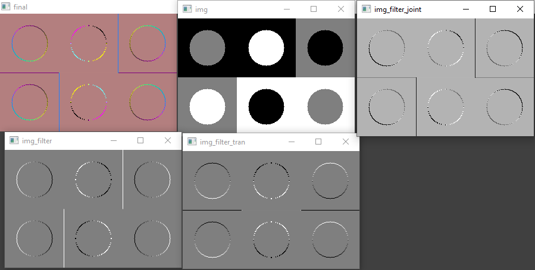

# misis2024s-21-02-suchoruchenkov-m-e

# Отчет по 5 ЛР

Цель:

Автоконтрастирование по квантилям черного и белого одноканального изображения.

Ход работы:

Код принимает на вход размер изображений и радиус кругов, затем генерирует тестовое изображение с кругами различной интенсивности.

Затем в функции main задаются ядро фильтра (kernel) и транспонированное ядро (kernelTran). Используя функцию cv::filter2D, изображение фильтруется с помощью этих ядер. После фильтрации для каждого пикселя вычисляется новое значение интенсивности на основе предыдущего значения с использованием линейной функции c(x) = 127.5 + 0.2 * c_prev(x). Это позволяет нормализовать диапазон интенсивности пикселей от [-255, 255] до [0, 255], учитывая возможные отрицательные значения после фильтрации. Этот процесс повторяется как для kernel, так и для kernelTran.

Далее на основе двух полученных изображений вычисляется третье изображение по формуле sqrt(x1x1 + x2x2), где x1 и x2 - значения интенсивности соответствующих пикселей из двух изображений.

Наконец, три изображения объединяются в одно трехканальное изображение, где каждый канал соответствует результатам фильтрации и вычисления производной изображений.

Таким образом, данный код выполняет операции фильтрации изображений, нормализации интенсивности, вычисления производных и объединения результатов в трехканальное изображение для дальнейшего анализа и визуализации.

Основные моменты программы:

1. Функция `testImage` создает изображение с различными кругами разного цвета на фоне. Функция принимает ширину и высоту изображения, а также радиус кругов.
2. В функции `main`:
   - Создается изображение с помощью функции `testImage` с заданными параметрами.
   - Отображается начальное изображение.
   - Создается ядро для фильтрации (пример - дискретная аппроксимация производной).
   - Применяется фильтрация изображения с помощью функции `cv::filter2D`.
   - Результат фильтрации преобразуется в отображаемый формат (CV_8UC1) с помощью цикла для корректного отображения.
   - Второе ядро создается для фильтрации транспонированным образом.
   - Фильтрация второго ядра и преобразование результата аналогично первому ядру.
   - Вычисляется производная по двум направлениям и результат сохраняется в отдельное изображение.
   - Создается трехканальное изображение, объединяющее результаты фильтрации в разные каналы.
   - Отображаются промежуточные и конечное результаты фильтрации.

Результат:

